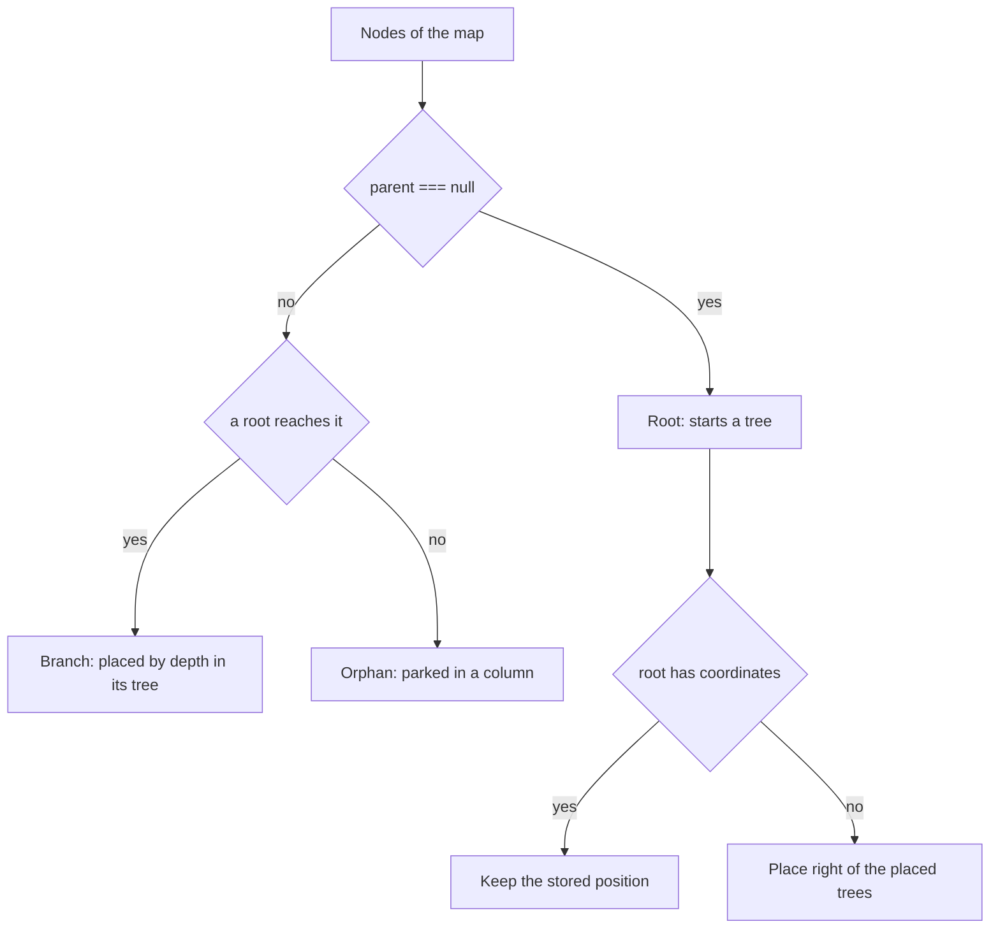

## Context

The layout engine in `packages/mmp` builds one d3 hierarchy from the node the map calls the root, splits the root's children into a left and a right side, and assigns each depth a column. It parks any node the hierarchy never reaches in a single column right of the tree's bounding box, stacked downward, with no branch drawn. The **detached node** reuses that fallback: `MmpService.addNode` refuses to give a detached node children, the Mermaid export skips it, and `LayoutEngine.placeDetachedNodes` parks it.

`LayoutEngine` positions only snapshot nodes: a map load, an import, a redistribution. An interactive add never runs it. `Nodes.addNode` computes the new node's position in `calculateCoordinates`, picks its side in `pickColumn`, and reads sides through `getOrientation`, which compares a node's x against `map.rootId`, the single root the map knows. Paste mirroring (`CopyPaste.calculatePastedCoordinates`), drag feedback and keyboard navigation read the same `getOrientation`.

`isRoot` answers two questions with one boolean: whether a node has a parent, and whether the map must keep that node. A second parentless node with children makes the two answers diverge, so a reader asking one question can receive the other answer.

## Goals / Non-Goals

**Goals:**

- A map holds any number of **trees**, each a root node with descendants to any depth
- Every tree renders with the layout and the branch colors the single tree gets today, around its own root
- Delete, copy and paste operate on a whole tree when the user selects its root
- Mermaid export and import round-trip a multi-tree map
- Existing detached nodes survive the removal of the flag as trees, at their stored positions

**Non-Goals:**

- Re-parenting a node across trees by drag
- Promoting a branch node into a root
- Renaming `isRoot`, or storing the main-root mark on the map row
- Keeping trees apart after creation
- Connections drawn between trees

## Decisions

### 1. Root by parent, main root by `isRoot`

A node is a **root** when `parent === null`. No stored flag answers that question, so no two sources can disagree.

`isRoot` keeps its name in the wire types, the Y.Doc node map and the `mmp_node.root` column, and it marks the **main root** only. Exactly one node per map carries it, and `NodeService` refuses to delete that node. A detached node already carries `isRoot = false`, so the migration leaves the mark untouched.

Readers split by the question they ask:

| Reader | Question today | Question after |
|--------|----------------|----------------|
| Layout engine | `isRoot` starts the hierarchy | every parentless node starts a hierarchy |
| Bulk add (`Nodes.addNodes`) | an empty parent falls back to the selected node | an empty parent adds a root |
| Interactive placement (`calculateCoordinates`, `pickColumn`) | the child of `isRoot` splits left and right | the child of any root splits left and right |
| Orientation (`getOrientation`: keyboard navigation, drag, paste mirroring) | side relative to `map.rootId` | side relative to the root of the node's own tree |
| Sibling navigation (`moveSelectionOnLevel`) | `isRoot` has no siblings; children of `isRoot` search by side | the same rules for every root and its children |
| Branch color setter (`updateNodeBranchColor`) | `isRoot` draws no branch, so the setter skips it | every root draws no branch, so the setter skips every root |
| Delete guard | `isRoot` blocks deletion | unchanged |
| Copy and cut guard | `isRoot` blocks copy and cut | unchanged; any other root copies with its tree |
| Paste | copies `isRoot` from the source | writes `isRoot = false` on every pasted node |
| Mermaid export | `isRoot` picks the single block | every root opens a block, main root first |
| Mermaid import | `processNode` defaults `isRoot = true` | only the first block's root carries the mark |
| Yjs replacement guard | an `isRoot` entry write means "map replaced" | unchanged, see decision 5 |
| Map list and share dialog | `isRoot` names the map | unchanged |

**Alternative rejected:** rename the flag to `isMainRoot`. An old client writes `isRoot` into the Y.Doc during a deploy, so the rename needs a dual-write window or leaves the map with no main root, and a rollback needs a down-migration. Keeping the name costs nothing, because detached nodes, the only other parentless nodes, already carry `false`.

**Alternative rejected:** store the main root as `mmp_map.mainRootNodeId`. A foreign key would make a second main root impossible by construction, which is the stronger design, but it changes the create-map payload every client sends and costs a two-way migration.

**Alternative rejected:** reuse `detached` for the new roots. Everything `detached` controls means "this content does not exist": the layout engine parks the node and drops any hierarchy under it, `MmpService.addNode` refuses it children, the Mermaid export skips it, and a new one stacks downward instead of following placement. `detached` is also the only way `Nodes.addNode` receives a null parent today: `addNodes` passes a root's empty parent id, and `addNode` falls back to the selected node. `addNode` therefore takes an explicit `null` parent for a root, and `addNodes` passes `null` for an empty parent.

### 2. One layout pass per tree

`LayoutEngine` runs once per root with that root's coordinates as the anchor, which reuses the left and right split, the column offsets and the alignment without a branch for "second tree". Every root keeps its stored coordinates. A redistribution lays out each tree around its own root and moves no root.

A root without coordinates occurs only in a snapshot such as a Mermaid import. The engine places each such root to the right of the trees already placed, separated by one horizontal spacing.

Corrupt data can mark two nodes with `isRoot`. The engine then lays out the first marked node as the main root and every other marked node as an ordinary root, so each one starts a tree and its descendants get laid out around it.

An orphan is a node that no root reaches, because its parent names a row that no longer exists or its ancestors form a cycle. It keeps today's recovery: the layout parks it in a column right of every tree, and it never starts a tree. `placeDetachedNodes` already applies to every node the root never reaches, so it stays as the orphan fallback under a new name.

### 3. Interactive placement per tree

The interactive readers from decision 1 resolve a node's tree root by walking its parents, and they measure against that root:

- `getOrientation` compares a node's x against its tree root's x.
- `pickColumn` splits the children of any root between left and right.
- Paste mirroring and drag feedback read the new `getOrientation`.

The client that creates a tree through the add-tree button or a paste with nothing selected computes the root's position once. It takes the bounding box of every tree it holds and places the new root two horizontal spacings to the right, level with the main root, then writes those coordinates like any other node's. `pickColumn` puts a root's first child one spacing to the root's left, and the client reserves the second spacing for that child. A child label wider than two spacings still reaches the neighboring tree. From then on the root carries stored coordinates and never moves on its own.

Placement happens at creation only. The coordinate columns are NOT NULL, so after the first save no stored state marks a root as automatically placed, and a later pass cannot tell such a root from one the user dragged. Two clients that add trees at once place them in the same free spot, and a growing tree can reach its neighbor. Both cases overlap until a user drags a tree away.

Every root takes branch color `''`, the main root's default. `MmpService.addNode` gives a child its parent's branch color first, so a root with a set branch color would pass one color to all its children. With `''` a root's children fall through to the automatic branch colors setting, exactly as the main root's children do.

### 4. Empty selection and paste

`Nodes.deselectNode` selects the main root today, and `initMap` selects the main root when a map loads, so no state represents "nothing selected". The selected node becomes `Node | null`. Deselecting leaves it `null`, and a map load still selects the main root. The empty selection applies to every user, because `packages/mmp` reads no flag.

With nothing selected:

- Node-specific toolbar buttons are disabled, and the add-tree and paste buttons stay enabled.
- Keys that act on the selected node do nothing.
- Presence broadcasts an empty selection, and peers draw no selection ring for that client.

Paste attaches the copied nodes under the selected node. With nothing selected, paste creates an independent tree placed as decision 3 describes. Every pasted node gets `isRoot = false`, whatever the source carried. Copy and cut keep refusing the main root and accept any other root together with its tree.

### 5. Replacement detection keeps reading the main-root mark

`YjsSyncService.isFullMapReplacement` reports a replacement when a transaction adds or updates the top-level `nodes` entry of a node carrying `isRoot`. With `isRoot` marking the main root only, the check keeps its meaning. The main root's entry is written only when the whole node set is rewritten: an import, a redistribution, or an undo of either. Yjs reports a delete and re-set of the same key as `update`, and the guard already reads `update`. Adding or pasting a tree writes roots without the mark, and the observer applies them as ordinary adds, so the undo stack survives.

The guard stays. Tests pin the two new cases: a peer adding a tree and a peer pasting a tree both apply as ordinary adds.

### 6. Parent-first ordering and orphans on save

`sortNodesParentFirst` walks breadth-first from the single node `findRootNode` returns and appends whatever it never reached, in input order, which lets a child precede its parent. The Yjs persist step writes one multi-row upsert, and Postgres checks the foreign key at the end of that statement, so row order does not matter there. `MapsService.saveAllNodesInTransaction`, used by duplicating a map, and `MapsService.saveValidNodes` insert row by row, in order-number order, so a second root's children can reach the database before their root.

The replacement walks each tree to completion before the next, main tree first, so order numbers group by tree and a detached node keeps its place after the main tree. Callers that need the one protected node call `findMainRoot` instead.

An orphan can never pass the composite foreign key `(nodeMapId, nodeParentId)`, whatever the order. Today one orphan in the Y.Doc fails every persist of that map, and the debounce retries it forever. The save instead leaves out every node no root reaches, logs their ids, and writes the rest. The orphan still renders parked until the map reloads, and after a reload it is gone.

### 7. Mermaid import per block

The parser accepts one `mindmap` block per parse and throws on a second root. `ImportService` splits the document at each `mindmap` line, parses each block, and builds one snapshot holding every tree. The first block's root carries `isRoot`, and every other block's root carries `false`. One `importMap` call replaces the whole map with that snapshot, since each call replaces the map and per-block calls would keep only the last block.

### 8. What `detached` does today, and why removing it is safe

The toolbar's "add detached node" button (`ToolbarComponent.addDetachedNode`) calls `MmpService.addNode({ detached: true })`. The German label calls it a free node "for comments", and the flag has served that purpose since it was introduced in #204. Eight readers depend on it:

| Reader | Behavior today | After |
|--------|----------------|-------|
| `Nodes.addNode` | a detached node gets a null parent; the flag is the only path to one | an explicit `null` parent (decision 1) |
| `MmpService.addNode` | places the new node 80 px above the selected node; adds nothing while a detached node is selected | add-tree placement (decision 3); the early return goes |
| `getSiblings`, `pickColumn`, `stackBelow` | a detached node has no siblings, no column offset, no vertical shift | a root has no parent, so no siblings; add-tree sets the position |
| `LayoutEngine.indexChildren` | never makes a detached node a child, even with a parent id | a root has no parent |
| `LayoutEngine.placeDetachedNodes` | keeps every node the root never reaches at its coordinates, or parks it in a column | the same fallback for orphans, renamed |
| `Draw.drawBranch` | draws no branch for a null parent | unchanged |
| `ExportService.createChildrenMap` | skips detached nodes, so Mermaid drops them and their descendants | every root exports a block |
| Y.Doc, wire types, `mmp_node.detached` | carry the flag | removed |

Three facts make removal safe:

1. **No detached node has a parent.** `Nodes.addNode` has nulled the parent of every detached node since #204, and the backend refused a detached node with a parent at the time. A detached node is therefore already a parentless node, which is a root once the renderer accepts several roots.
2. **Nothing under a detached node is lost.** `CopyPaste.paste` has no detached guard, so a user could paste a subtree under a detached node. The layout never reached that subtree and kept its stored coordinates, while `Draw` still drew its branches. After removal it becomes that root's tree at the same coordinates. Only a redistribution or a Mermaid export shows the difference, and both now include it.
3. **No reader needs the value once the code stops reading it.** A leftover `detached = true` row, for example one that a backend instance still holding an old Y.Doc writes back during a rolling deploy, changes nothing, because the parent is already null.

The separate step that sets `detached = false` is therefore redundant. The retiring release drops the column in one migration, and that migration first sets the parent to null on any detached row that carries one, to match what the renderer always showed. The down-migration re-adds the column with default `false`.

A user who relied on a detached node as a comment beside a specific node keeps it at its position. New trees appear right of the other trees instead, so comment placement is gone.

### 9. Rollout order

1. The renderer, the shared algorithms, the layout and the sync observer learn several roots. None of these changes alters a single-tree map, and `packages/mmp` reads no flag.
2. The `multiTree` flag, off by default, gates the add-tree button and pasting as a tree in the frontend. An operator can turn it on to try the feature. The same release removes the early return in `MmpService.addNode` for every user, flag or not, so a user can add children to a selected detached node. The empty selection of decision 4 also ships to every user, flag or not. Until the final release, the layout engine parks the children of a detached node as orphans on a redistribution.
3. The final release removes the flag, replaces the detached-node button with the add-tree button for every user, stops reading and writing `detached`, and drops the column in a migration.

Step 3 bundles the flag removal with the retirement so that the toolbar never offers both buttons and never offers neither. A frontend older than step 1 attaches a parentless node that is not detached under the selected node, so step 3 runs only once no such frontend is deployed. Rolling back past step 3 needs the down-migration, and the rolled-back frontend then shows that same misplacement for former detached nodes until the map reloads.
